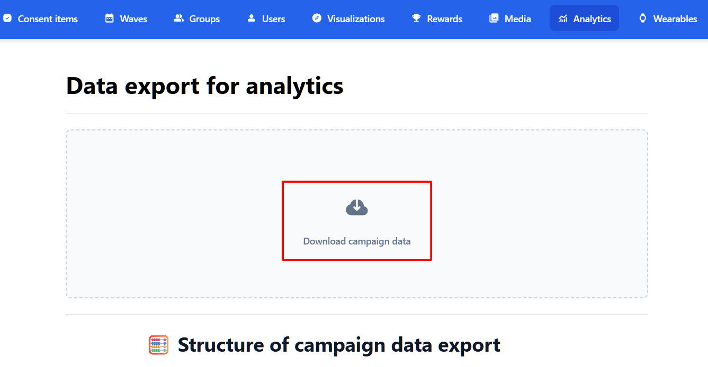
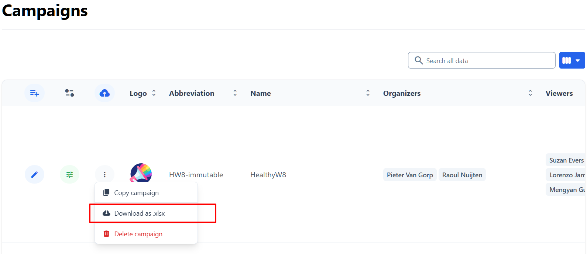

# GameBus Data Analyzer

A tool for extracting and analyzing health behavior data from the GameBus platform.

## Overview

This project extracts user activity data from the GameBus API and performs various analyses to generate insights about user behavior, activity patterns, and engagement.
The script can technically run on Linux and Mac, but officially we support only Windows.

## Quick Start

1. **Install Python** and clone this repository
2. **Set up environment**: 
   ```
   python -m venv .venv
   .venv\Scripts\activate
   pip install -r requirements.txt
   ```
3. **Configure**:
   - Create `.env` file with `GAMEBUS_API_KEY=your_api_key_here`
   - For user data extraction, add user credentials to `config/users.xlsx` (see Configuration section below for format). You don't need user credentials if you intend to analyze only the data downloaded from GameBus campaigns website. 
   - For analysis, add campaign files: campaign data as `config/campaign_data.zip`, and campaign description as `config/campaign_desc.xlsx`. If you intend only to extract user data from the database, you don't need these files, only user credentials.



4. **Run**:
   ```
   python pipeline.py                    # Full pipeline (extraction + analysis)
   python pipeline.py --extract          # Only extract data
   python pipeline.py --analyze          # Only analyze existing data
   python pipeline.py --log-level DEBUG  # Verbose logging
   ```

## Detailed Start Guide

Follow these steps if you're new to running Python projects on Windows. Use Windows PowerShell for the commands below.

1) Install Python and add it to PATH
- Download Python from `https://www.python.org/downloads/` 
- During installation, check “Add python.exe to PATH”.
- Verify installation by typing in Windows PowerShell:
  ```
  python --version   # or: py --version
  ```

2) Get the project code
- Option A (recommended): Install Git for Windows (`https://git-scm.com/download/win`) and run in Windows PowerShell or in Git Bash:
  ```
  git clone https://github.com/oaglazunova/gamebus-data-analyzer.git
  ```
- Option B: Click “Code” → “Download ZIP” on GitHub, then unzip to a folder, e.g. `C:\Users\You\Documents\gamebus-data-analyzer`.

3) Open PowerShell (or Git Bash) in the project folder
- In File Explorer, right‑click the project folder → “Open in Terminal”, or:
  ```
  cd C:\Users\You\Documents\gamebus-data-analyzer
  ```

4) Create and activate a virtual environment
- Create venv (either command works):
  ```
  python -m venv .venv
  # or
  py -3 -m venv .venv
  ```
- Activate it (PowerShell):
  ```
  .\.venv\Scripts\Activate.ps1
  ```
- If you get “running scripts is disabled on this system”, temporarily allow it for this session:
  ```
  Set-ExecutionPolicy -Scope Process -ExecutionPolicy Bypass
  .\.venv\Scripts\Activate.ps1
  ```
- You should see `(.venv)` at the start of your prompt. To deactivate later, run `deactivate`.

5) Install dependencies
```
python -m pip install -r requirements.txt
```
If `pip` is not recognized, always prefer `python -m pip ...` on Windows.

6) Add your GameBus API key (.env). For security reasons, the API key will be sent by the GameBus team via Keybase (a secure messenger).
- Create a file named `.env` in the project root (same folder as `pipeline.py`).
- Put your client credentials key on a single line:
  ```
  GAMEBUS_API_KEY=your_api_key_here
  ```

7) Add users.xlsx
- Copy your list of users and passwords to `config\` and rename to `users.xlsx`.
- Verify that it has headers `email` and `password` (lowercase). Example row:
  ```
  email              | password
  user@example.com   | secret123

8) (Optional, only for analysis) Add campaign files
- Provide campaign description as `config\campaign_desc.xlsx`  
- Provide campaign data as `config\campaign_data.zip`

9) Run the pipeline
- Full run (extract + analyze):
  ```
  python pipeline.py
  ```
- Only extract or only analyze:
  ```
  python pipeline.py --extract
  python pipeline.py --analyze
  ```
- More logs:
  ```
  python pipeline.py --log-level DEBUG
  ```

10) Where results appear
- Raw JSON: `data_raw\`
- Analysis outputs: `data_analysis\`
- Logs: `logs\data_extraction.log` and `logs\data_analysis.log`

Troubleshooting on Windows
- “python is not recognized”: try `py` instead (e.g., `py -3 -m venv .venv`, `py pipeline.py`).
- “Permission denied” activating venv: run the `Set-ExecutionPolicy` command shown above and activate again.
- Pip SSL or proxy issues: try `python -m pip install --upgrade pip` or configure your corporate proxy per IT guidelines.
- If Excel files are open, some operations may fail—close them and retry.

## Project Structure

```
gamebus-data-analyzer/
├── config/                # Configuration files
├── src/                   # Source code
│   ├── extraction/        # Data extraction from GameBus
│   ├── analysis/          # Data analysis
│   ├── scripts/           # Utility scripts
│   └── utils/             # Utility functions
├── data_raw/              # Raw extracted data
├── data_analysis/         # Analysis output
├── logs/                  # Log files
└── pipeline.py            # Main pipeline runner
```

## Outputs and Logs

- Raw API data is saved under `data_raw/` as JSON files (e.g., `player_<id>_<descriptor>.json`) and a combined `player_<id>_all_raw.json` per user.
- Analysis results are saved under `data_analysis/` (e.g., `analysis_report.txt` and generated figures).
- Logs are written to `logs/data_extraction.log` (extraction) and `logs/data_analysis.log` (analysis).
- Tip: use `--log-level DEBUG` for more verbose output when running `pipeline.py`.

## Available Analyses

Running `python -m src.analysis.data_analysis` or `python pipeline.py --analyze` saves all outputs **directly under `data_analysis/`** (no `visualizations/` or `statistics/` subfolders). Descriptive statistics are printed to the console during the run.

**Activities (from `config/campaign_data.xlsx`, sheet `activities`)**
- Activity type distribution → `activity_types_distribution.png`
- Activities over time (daily) → `activities_over_time.png`
- Points by activity type (total) → `points_by_activity_type.png`
- Points by player → `points_by_player.png`
- Average rewarded points by activity type → `rewards_by_activity_type.png`
- Points over time (daily) → `points_over_time.png`
- Player activity counts (top 50 if many) → `player_activity_distribution.png`
- Activity type × player (heatmap) → `activity_type_by_player.png`
- Usage heatmap (weekday × hour) → `activity_heatmap_by_time.png`
- Activity types stacked by date → `activity_types_stacked_by_date.png`
- Player engagement heatmap (by day) → `player_engagement_heatmap.png`
- Activities by day of week → `usage_by_day_of_week.png`

**Campaign metrics & participation**
- Active vs Passive players (by rewarded tasks) → `player_active_vs_passive_pie.png`

- **Drop-out & joining**
- Drop-out histogram (first → last activity, days) → `dropout_rates_distribution.png`
- Joining histogram (campaign start → first activity, days) → `joining_rates_distribution.png`
- Combined KDE (drop-out vs joining) → `combined_dropout_joining_rates.png`
- Combined boxplots (drop-out vs joining) → `combined_dropout_joining_boxplots.png`

**Challenges / Tasks (from `config/campaign_desc.xlsx`: sheets `visualizations`, `challenges`, `tasks`)**
- Activity completion by type → `activity_completion.png`
- Activity type by hour → `activity_type_by_hour.png`
- Activity type by weekday → `activity_type_by_day.png`
- Active players per day → `active_players_per_day.png`
- Tasks by provider (mapped via `desc_tasks.dataproviders`, zero bars if none found) → `tasks_by_provider.png`
- Tasks completed per day → `tasks_completed_per_day.png`
- Tasks completed per player → `tasks_completed_per_player.png`

**Geofence & steps (from JSON in `data_raw/`)**
- Geofence hourly activity → `geofence_hourly_activity.png`
- Geofence speed by hour → `geofence_speed_by_hour.png`
- Movement trajectory (2D) → `geofence_movement_trajectory.png`
- Geofence 3D visualization → `geofence_3d_visualization.png`
- Steps trend (DAY_AGGREGATE) → `steps_trend.png`

See the documentation in `src/analysis/data_analysis.py` for details on specific analyses.


## Configuration

### Configuration Files

- `credentials.py`: API endpoints and authentication settings
- `paths.py`: File paths used throughout the project
- `settings.py`: General settings including valid game descriptors and API parameters
- `users.xlsx`: User credentials for GameBus API access (you must create this)
- `campaign_data.xlsx`: Campaign activity data (required for analysis), provided as either:
  - `campaign_data.xlsx` (single Excel file with multiple sheets), or
  - CSV files under `config/campaign_data/` (one CSV per sheet; filenames become sheet names).
  - If both are present, CSV files override matching sheets from `campaign_data.xlsx`.
- Campaign description data (required for analysis), provided as either:
  - `campaign_desc.xlsx` (single Excel file with multiple sheets), or
  - CSV files under `config/campaign_desc/` (one CSV per sheet; filenames become sheet names).
  - If both are present, CSV files override matching sheets from `campaign_desc.xlsx`.

### API Key

The GameBus API key must be stored in a `.env` file in the root directory:
For the API key, contact GameBus team.

```
GAMEBUS_API_KEY=your_api_key_here
```

### User Credentials

Create a `users.xlsx` file in the config directory with the following format:

```
email               | password      | UserID (optional)
---------------------|--------------|----------------
user@example.com     | password123  | 12345
```

Requirements:
- Must include header row with exact column names: `email` and `password` (lowercase)
- Note: You can use the Excel file with users generated for GameBus campaigns without any modifications

### Campaign Data

For analysis functionality, copy these files from the GameBus Campaigns website:
- Campaign data provided as either:
  - `campaign_data.xlsx` (contains activity data for all users), or
  - CSV files under `config/campaign_data/` (split per sheet).
- Campaign descriptions provided as either:
  - `campaign_desc.xlsx` (contains challenge descriptions and levels), or
  - CSV files under `config/campaign_desc/` (split per sheet).

### Game Descriptors

The `settings.py` file contains a list of valid game descriptors that the system will extract data for. You can modify this list to focus on specific types of activities.

## Troubleshooting

### Common Issues

1. **Authentication Failures**:
   - Ensure your API key in `.env` is correct and up-to-date
   - Check that user credentials in `users.xlsx` are valid

2. **Missing Data**:
   - Verify that the game descriptors you need are enabled in `settings.py`
   - Check that campaign files are correctly formatted and in the right location

3. **Analysis Errors**:
   - Ensure both campaign files are present and properly formatted
   - Check that raw data has been extracted before running analysis

### Performance Tips

- Reduce the number of users processed in parallel if experiencing rate limiting
- Comment out unused game descriptors in `settings.py` to speed up extraction
- Use the DEBUG log level to identify specific issues

### Security Note

Configuration files are tracked by Git, but sensitive content (XLSX files with credentials) is ignored through `.gitignore` rules. Always check that your credentials aren't accidentally committed.

## License

This project is licensed under the CC-BY-4.0 License.

## Visualization color palettes and accessibility

- Default theme: Seaborn "colorblind" palette with whitegrid background for readability.
- Categorical charts (bars, lines with distinct series):
  - BAR_COLORMAP = tab20 for many distinct categories.
  - LINE_COLORMAP = tab10 for up to ~10 lines; pandas/seaborn will cycle through the colorblind-friendly palette.
- Sequential data (heatmaps showing magnitude):
  - SEQUENTIAL_HEATMAP_COLORMAP = viridis (perceptually uniform, colorblind-friendly).
- Diverging data (values around a center, e.g., correlations):
  - CORRELATION_HEATMAP_COLORMAP = coolwarm; when plotting correlations, set center=0.
- Single-series bars (e.g., counts over time):
  - SINGLE_SERIES_COLOR = first color from the colorblind palette, used for consistent, accessible single-color bars.

Where to change:
- See src\analysis\data_analysis.py near the top (plot style and colormap constants). Update those constants to customize palettes project-wide.

Example to override in code (optional per script):
- In your analysis script, before plotting:
  - import seaborn as sns
  - sns.set_palette("deep")  # or any seaborn palette name
  - Or change BAR_COLORMAP/SEQUENTIAL_HEATMAP_COLORMAP constants in data_analysis.py.
