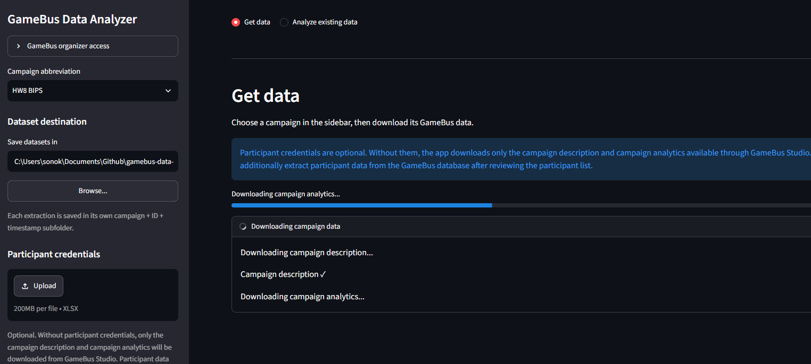
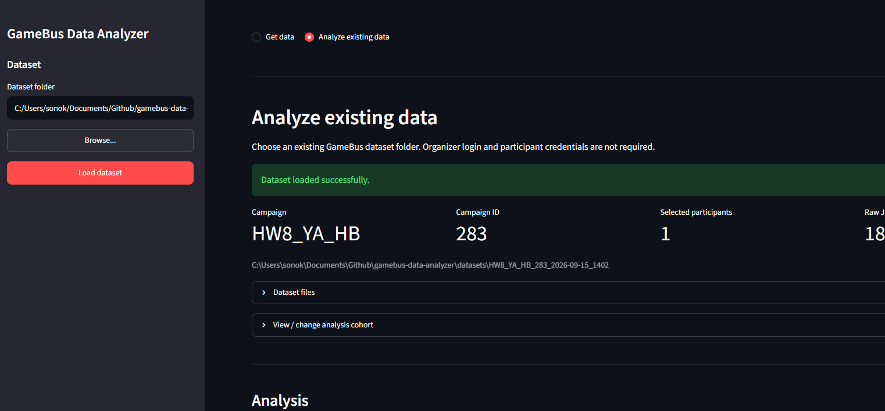

# GameBus Data Analyzer

GameBus Data Analyzer is a user-friendly tool for downloading and analyzing health-behavior data from GameBus campaigns.

The current version provides a Streamlit interface with two independent workflows:

- **Get data** — download campaign data from GameBus Studio and, optionally, participant data from the GameBus database.
- **Analyze existing data** — select a previously created dataset, review the analysis cohort, and generate analysis outputs.

The earlier command-line version of the analyzer is preserved as **GameBus Data Analyzer v1.2.0**.




---

## Requirements

The application is officially supported on Windows.

Recommended:

- Python 3.14
- Git (Optional, for cloning the repository)
- access to GameBus Studio
- a GameBus API key if participant data need to be downloaded 

To receive a GameBus API key, contact the GameBus team.

---

## Installation

Clone the repository:

```powershell
git clone https://github.com/oaglazunova/gamebus-data-analyzer.git
cd gamebus-data-analyzer
```
Alternatively, you can download the repository as a ZIP file and extract it.

### Recommended Windows installation

Open the `scripts` folder and double-click:

```text
install_windows.bat
```

The installer:

- checks that Python 3.14 is available;
- creates a local `.venv` virtual environment;
- installs the dependencies from `requirements.txt`;
- checks that the installed dependencies are consistent.

If `.venv` already exists, the installer recreates it.

### Manual installation

Alternatively, create and activate the virtual environment manually:

```powershell
py -3.14 -m venv .venv
.\.venv\Scripts\Activate.ps1
```

If PowerShell blocks script execution:

```powershell
Set-ExecutionPolicy -Scope Process -ExecutionPolicy Bypass
.\.venv\Scripts\Activate.ps1
```

Install dependencies:

```powershell
python -m pip install -r requirements.txt
```

---

## Starting the application

### Recommended Windows start

Open the `scripts` folder and double-click:

```text
run_app.bat
```

The application should open in your browser.

Keep the terminal window open while the application is running. Close the window or press `Ctrl+C` to stop it.

### Manual start

From the repository root, run:

```powershell
python -m streamlit run streamlit_app.py
```

The application opens in the browser.

Two actions are available:

- **Get data**
- **Analyze existing data**

---

# Get data

Use **Get data** to create a new self-contained GameBus dataset.

## Campaign data

Enter:

- GameBus organizer email
- organizer password, if required
- campaign abbreviation
- dataset destination folder

The application downloads directly from GameBus Studio:

- the campaign description XLSX;
- the campaign analytics ZIP;
- the list of accounts associated with the campaign.

The original filenames returned by GameBus are preserved.

Organizer credentials can optionally be remembered. The password is stored through the operating-system keyring rather than in the dataset.

---

## Participant data

Participant credentials are optional.

Without a participant-credentials file, the application downloads the campaign description and campaign analytics from GameBus Studio. These are sufficient for analyses based on campaign activity and campaign configuration.

To additionally download participant data from the GameBus database, provide an XLSX file containing at least:

```text
email | password
```

Additional columns are allowed.

The credentials file is used only during the current application session. It is **not copied into the dataset** and participant passwords are not stored in dataset manifests.

Downloading participant data also requires a GameBus API key.

Create a `.env` file in the project root:

```text
GAMEBUS_API_KEY=your_api_key_here
```

Contact the GameBus team if you need an API key.

---

## Participant review

After campaign data are downloaded, the application can show all accounts associated with the campaign.

The researcher can choose which accounts should be included in analysis, for example to exclude test or administrator accounts.

Analysis selection and participant-data extraction are separate decisions.

Excluding an account from analysis:

- does not delete downloaded data;
- does not modify the GameBus campaign;
- does not remove participant data that were previously downloaded.

---

# Dataset structure

Each download is stored in its own folder.

The default folder name is:

```text
CAMPAIGN-ABBREVIATION_CAMPAIGN-ID_YYYY-MM-DD_HHMM
```

Example:

```text
HW8_YA_HB_283_2026-09-15_1516/
```

A dataset may contain:

```text
HW8_YA_HB_283_2026-09-15_1516/
├── campaign-283.xlsx
├── campaign-283-export.zip
├── campaign_users.json
├── extraction_manifest.json
├── cohort_manifest.json
├── data_raw/
└── data_analysis/
```

### `campaign-<id>.xlsx`

Campaign configuration downloaded from GameBus Studio.

### `campaign-<id>-export.zip`

Campaign analytics downloaded from GameBus Studio.

The export normally contains:

```text
1-aggregated-data.csv
2-activities.csv
3-navigation-events.csv
4-notification-events.csv
5-sensor-events.csv
```

### `campaign_users.json`

A safe snapshot of the campaign accounts obtained from GameBus Studio.

It contains only identifiers required for cohort review, such as:

- account ID;
- player ID (PID);
- email.

Passwords, authentication tokens, password hashes, and similar sensitive fields are not stored here.

### `extraction_manifest.json`

Records how the dataset was obtained and which campaign files belong to it.

### `cohort_manifest.json`

Records the researcher-confirmed analysis cohort and participant-data extraction history.

It is created after participant review.

### `data_raw/`

Contains participant data downloaded from the GameBus database.

This folder may be empty if participant credentials were not supplied or participant-data extraction was not performed.

### `data_analysis/`

Contains generated reports, statistics, and figures.

Running the analysis again replaces the contents of this folder but does not modify the source campaign or participant data.

---

# Analyze existing data

Use **Analyze existing data** to analyze a dataset created by the current dataset workflow.

Select the dataset folder and click **Load dataset**.

Organizer credentials and participant passwords are not required for analysis.

The application displays:

- campaign abbreviation;
- campaign ID;
- number of participants selected for analysis;
- number of available participant-data JSON files;
- detected campaign files.

---

## Analysis cohort

This is done to exclude test accounts or other participants that the researcher does not want to include in the analysis.

If the dataset already contains `cohort_manifest.json`, the saved cohort is used. The cohort can be reviewed or changed before another analysis run.

Changing the analysis cohort does not:

- delete downloaded participant data;
- trigger additional data extraction;
- alter the original campaign exports.

If a dataset has `campaign_users.json` but no cohort manifest, the application asks the researcher to review the campaign accounts and creates `cohort_manifest.json` before analysis.

---

## Analysis outputs

Analysis results are written inside the selected dataset:

```text
data_analysis/
```

The analysis includes, where the required data are available:

### Campaign activity

- activity type distributions;
- activity over time;
- awarded points;
- participant activity distributions;
- activity heatmaps;
- activity by weekday and hour;
- engagement over time;
- wave comparisons.

### Participation and engagement

- active/passive participant summaries;
- joining;
- activity span;
- dropout;
- weekly retention;
- churn-related metrics.

### Campaign configuration

- challenge analysis;
- task analysis;
- activity completion;
- tasks by provider;
- task completion over time and by participant;
- rewards by challenge and rule.

### Participant data

When relevant participant data are available in `data_raw/`, additional analyses can include:

- steps;
- geofence activity;
- movement summaries and visualizations.

The generated textual report is saved as:

```text
data_analysis/analysis_report.txt
```

Additional figures and statistics are stored in the same dataset-specific `data_analysis/` directory and its subdirectories.

---

# Cohort semantics

The application distinguishes between:

1. **selected for analysis**
2. **selected for participant-data extraction**
3. **participant data successfully downloaded**

These states are intentionally independent.

For example, participant data may already have been downloaded while the researcher later decides to exclude that participant from a particular analysis.

Changing the analysis cohort does not erase extraction history.

---

# Security and credentials

The application follows several rules intended to keep credentials separate from research datasets:

- participant passwords are never stored in dataset manifests;
- participant credentials XLSX files are not copied into datasets;
- organizer passwords can optionally be stored using the operating-system keyring;
- dataset files contain only the identifiers and metadata needed for reproducibility and analysis.

Do not commit `.env`, credentials files, session cookies, or participant data to Git.

---

# Earlier command-line workflow — v1.2.0

GameBus Data Analyzer v1.2.0 used the original command-line workflow based on files such as:

```text
config/users.xlsx
config/campaign_data.zip
config/campaign_desc.xlsx
data_raw/
```

and commands such as:

```powershell
python pipeline.py --extract
python pipeline.py --analyze
```

That version is preserved in:

```text
tag:    v1.2.0
branch: release/v1.2.0
```

Use v1.2.0 for datasets prepared specifically for that earlier folder structure.

The current Streamlit application uses the dataset-folder workflow described above.

---

# Running tests

Run the full test suite from the repository root:

```powershell
python -m unittest discover -s tests -p "test_*.py" -v
```

---

# Project structure

```text
gamebus-data-analyzer/
├── scripts/
│   ├── install_windows.bat
│   └── run_app.bat
├── src/
│   ├── acquisition/       # Campaign and participant-data acquisition
│   ├── analysis/          # Analysis and reporting
│   ├── datasets/          # Dataset layout, manifests and validation
│   ├── extraction/        # GameBus participant-data extraction
│   ├── ui/                # Streamlit UI
│   └── utils/
├── tests/
├── datasets/              # Default location for datasets
├── streamlit_app.py       # Streamlit entry point
├── pipeline.py            # Earlier command-line entry point
├── requirements.txt
└── README.md
```

---

## Game descriptors

Participant-data extraction uses the GameBus game descriptors configured in:

```text
config/settings.py
```

If GameBus introduces new descriptors, this list may need to be updated.

The same configuration can also be used to restrict which types of participant data are extracted.

---

## License

See `LICENSE`.